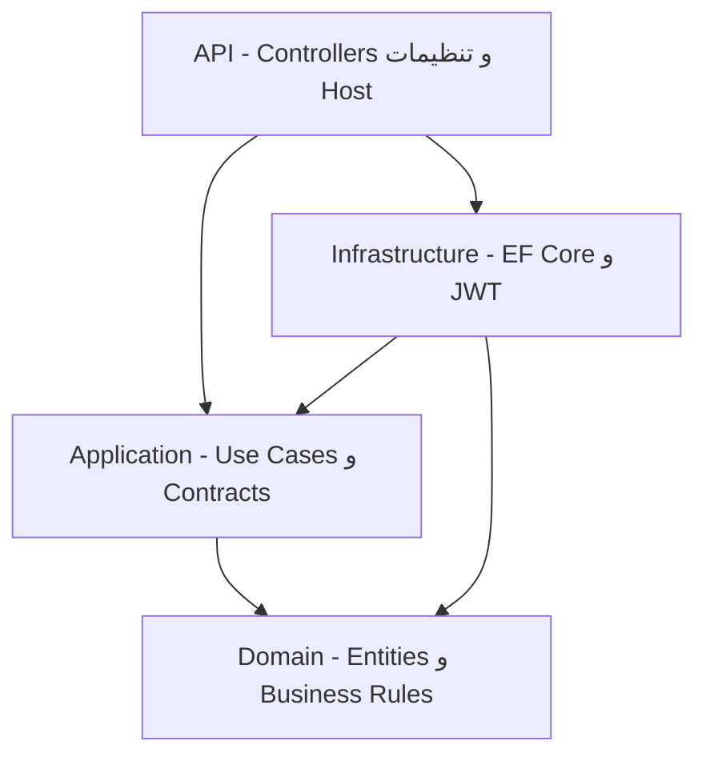

# Order Management Service

یک REST API برای مدیریت مشتریان، محصولات، موجودی و سفارش‌های فروشگاه آنلاین است. پروژه با **.NET 8**، **ASP.NET Core Web API**، **Entity Framework Core 8** و **SQL Server** پیاده‌سازی شده و از JWT برای احراز هویت و کنترل دسترسی مبتنی بر نقش استفاده می‌کند.

## امکانات اصلی

- ایجاد، مشاهده، جست‌وجو و حذف سفارش
- فیلتر سفارش‌ها بر اساس مشتری، وضعیت و بازه زمانی همراه با صفحه‌بندی
- تغییر مرحله‌ای وضعیت سفارش: `Pending -> Confirmed -> Shipped -> Delivered`
- کنترل و کسر موجودی هنگام تأیید سفارش
- ثبت گروهی سفارش‌ها با `AddRangeAsync` و یک‌بار `SaveChanges`
- مدیریت مشتری، محصول، موجودی، کاربر و نقش
- احراز هویت JWT همراه با Refresh Token، چرخش Refresh Token و Logout
- کنترل دسترسی با نقش‌های `Admin` و `User`
- مستندات Swagger و پشتیبانی از Bearer Token
- ثبت لاگ در Console و فایل با Serilog
- مدیریت متمرکز خطاها و پاسخ‌های استاندارد خطا

## تکنولوژی‌ها

| بخش | تکنولوژی |
| --- | --- |
| Runtime | .NET 8 / ASP.NET Core 8 |
| Database | SQL Server |
| ORM | Entity Framework Core 8 - Code First |
| Authentication | JWT Bearer + Refresh Token |
| Logging | Serilog - Console و Rolling File |
| API Documentation | Swagger / OpenAPI |

## معماری پروژه

پروژه از چهار لایه با جهت وابستگی مطابق Clean Architecture تشکیل شده است:



### Domain

این لایه مدل‌ها و قواعد اصلی کسب‌وکار را نگه می‌دارد و به لایه دیگری وابسته نیست. موجودیت‌های اصلی شامل `Order`، `OrderItem`، `Customer`، `Product`، `Inventory`، `User`، `Role` و `RefreshToken` هستند. قاعده انتقال وضعیت سفارش در خود Domain قرار دارد.

### Application

Use Caseها، DTOها، قرارداد Repositoryها و سرویس‌های کاربردی در این لایه قرار دارند. سرویس‌ها نتیجه عملیات را با `OperationResult` برمی‌گردانند تا خطاهای قابل انتظار کسب‌وکار از Exceptionهای غیرمنتظره جدا شوند.

### Infrastructure

پیاده‌سازی EF Core، Repositoryها، Unit of Work، Migrationها، تولید JWT، هش رمز عبور و ذخیره هش Refresh Token در این لایه قرار دارد. کوئری‌های فقط‌خواندنی Repository عمومی با `AsNoTracking` اجرا می‌شوند.

### API

Controllerها، اعتبارسنجی مدل ورودی، تنظیم JWT Bearer، Swagger، Serilog و Global Exception Handler در این لایه قرار دارند. Endpointهای مدیریتی با نقش `Admin` محافظت شده‌اند.

## تصمیمات طراحی مهم

- **Repository + Unit of Work:** وابستگی Application به EF Core حذف شده و تغییرات هر Use Case در یک `SaveChangesAsync` ثبت می‌شوند. خود EF Core عملیات یک `SaveChanges` را به‌صورت تراکنشی اجرا می‌کند.
- **کنترل موجودی در زمان Confirm:** سفارش در وضعیت `Pending` ایجاد می‌شود. موجودی فقط هنگام انتقال به `Confirmed` بررسی و رزرو می‌شود؛ در صورت کمبود موجودی وضعیت تغییر نمی‌کند.
- **جلوگیری از جهش وضعیت:** انتقال مستقیم، برای مثال از `Pending` به `Shipped`، مجاز نیست.
- **قیمت تاریخی سفارش:** قیمت محصول هنگام ایجاد سفارش داخل `OrderItem.UnitPrice` کپی می‌شود تا تغییر بعدی قیمت محصول مبلغ سفارش قبلی را تغییر ندهد.
- **Refresh Token امن‌تر:** مقدار خام Refresh Token در دیتابیس ذخیره نمی‌شود؛ هش SHA-256 آن ذخیره و هنگام Refresh، توکن قبلی باطل و توکن جدید صادر می‌شود.
- **Role Claim:** نقش‌های فعال کاربر به Claimهای JWT اضافه می‌شوند و `[Authorize(Roles = "Admin")]` از همان Claimها استفاده می‌کند.
- **Query Filter:** برای موجودیت‌های دارای `IActivable` فیلتر سراسری `IsActive` اعمال شده است.
- **Audit Fields:** مقدار `CreatedAt` و `UpdatedAt` پیش از ذخیره توسط `MainDbContext` تنظیم می‌شود.
- **Soft deactivation:** محصول، کاربر و نقش به‌جای حذف فیزیکی قابلیت فعال/غیرفعال شدن دارند.

## پیش‌نیازها

- [.NET SDK 8](https://dotnet.microsoft.com/download/dotnet/8.0)
- SQL Server 2019 یا جدیدتر، SQL Server Express یا LocalDB
- ابزار EF Core CLI با نسخه سازگار با پروژه

نصب ابزار EF Core در صورت نیاز:

```bash
dotnet tool install --global dotnet-ef --version 8.0.30
```

اگر ابزار از قبل نصب شده است:

```bash
dotnet tool update --global dotnet-ef --version 8.0.30
```

## اجرای محلی

### 1. دریافت و Build پروژه

از پوشه‌ای که فایل `OrderManagementService.sln` در آن قرار دارد اجرا کنید:

```bash
dotnet restore
dotnet build --configuration Release
```

### 2. تنظیم Connection String

مقدار فعلی در `OrderManagementService.Api/appsettings.json` از Windows Authentication استفاده می‌کند، اما نام Server در آن مشخص نشده است:

```text
Initial Catalog=OrderManagementDB;Integrated Security=True;MultipleActiveResultSets=True;Encrypt=True;TrustServerCertificate=True
```

بنابراین پیش از اجرای Migration، مقدار `Server` را متناسب با SQL Server سیستم تنظیم کنید. برای نمونه، Connection String مربوط به LocalDB در ویندوز:

```text
Server=(localdb)\MSSQLLocalDB;Database=OrderManagementDB;Integrated Security=True;MultipleActiveResultSets=True;Encrypt=True;TrustServerCertificate=True
```

برای جلوگیری از نگهداری اطلاعات حساس در Git، می‌توان Connection String و کلید JWT را با Environment Variable جایگزین کرد.

PowerShell:

```powershell
$env:ConnectionStrings__DefaultConnection="Server=localhost;Database=OrderManagementDB;User Id=sa;Password=<STRONG_PASSWORD>;Encrypt=True;TrustServerCertificate=True"
$env:Jwt__SecretKey="<AT_LEAST_32_BYTE_RANDOM_SECRET>"
```

Bash:

```bash
export ConnectionStrings__DefaultConnection='Server=localhost;Database=OrderManagementDB;User Id=sa;Password=<STRONG_PASSWORD>;Encrypt=True;TrustServerCertificate=True'
export Jwt__SecretKey='<AT_LEAST_32_BYTE_RANDOM_SECRET>'
```

کلید JWT باید حداقل 32 بایت باشد. مقدار موجود در `appsettings.json` صرفاً برای محیط توسعه است و نباید در Production استفاده شود.

### 3. ایجاد دیتابیس و اجرای Migration

Migration اولیه در پروژه موجود است. برای ایجاد یا به‌روزرسانی دیتابیس اجرا کنید:

```bash
dotnet ef database update \
  --project OrderManagementService.Infrastructure \
  --startup-project OrderManagementService.Api
```

### 4. اجرای API

```bash
dotnet run --project OrderManagementService.Api --launch-profile https
```

آدرس‌های پیش‌فرض:

- Swagger: `https://localhost:7276/swagger`
- API HTTPS: `https://localhost:7276`
- API HTTP: `http://localhost:5118`

در صورت خطای گواهی HTTPS توسعه:

```bash
dotnet dev-certs https --trust
```

Swagger فقط در محیط `Development` فعال است. پروفایل‌های موجود در `launchSettings.json` این محیط را تنظیم می‌کنند.

## دریافت JWT آزمایشی

### نکته مهم درباره دیتابیس تازه

Migration فعلی جدول‌ها را ایجاد می‌کند، اما Admin اولیه Seed نشده است. از طرف دیگر، Endpoint ساخت کاربر فقط برای Admin قابل دسترس است. بنابراین برای اولین ورود باید یک Admin اولیه در دیتابیس توسعه ایجاد شود.

اسکریپت زیر را **فقط روی دیتابیس توسعه و پس از اجرای Migration** اجرا کنید. این اسکریپت کاربر زیر را ایجاد می‌کند یا اطلاعات ورود آن را برای تست بازنشانی می‌کند:

- Username: `admin`
- Password: `Admin@123`
- Role: `Admin`

```sql
USE [OrderManagementDB];
GO

IF NOT EXISTS (SELECT 1 FROM [Roles] WHERE [Name] = N'Admin')
BEGIN
    INSERT INTO [Roles] ([Name], [IsActive])
    VALUES (N'Admin', 1);
END;

UPDATE [Roles]
SET [IsActive] = 1
WHERE [Name] = N'Admin';
GO

IF NOT EXISTS (SELECT 1 FROM [Users] WHERE [Username] = N'admin')
BEGIN
    INSERT INTO [Users] ([Username], [PasswordHash], [IsActive], [CreatedAt], [UpdatedAt])
    VALUES
    (
        N'admin',
        N'AQAAAAIAAYagAAAAEMNRuOXkXfvGqBVGIP8IO/rJ7a+14WbIWpedabZCj6IhcPFGsSbnRssT38ebMpVomA==',
        1,
        SYSUTCDATETIME(),
        NULL
    );
END;

UPDATE [Users]
SET
    [PasswordHash] = N'AQAAAAIAAYagAAAAEMNRuOXkXfvGqBVGIP8IO/rJ7a+14WbIWpedabZCj6IhcPFGsSbnRssT38ebMpVomA==',
    [IsActive] = 1,
    [UpdatedAt] = SYSUTCDATETIME()
WHERE [Username] = N'admin';
GO

DECLARE @AdminRoleId BIGINT = (SELECT TOP 1 [Id] FROM [Roles] WHERE [Name] = N'Admin');
DECLARE @AdminUserId BIGINT = (SELECT TOP 1 [Id] FROM [Users] WHERE [Username] = N'admin');

IF NOT EXISTS
(
    SELECT 1
    FROM [RoleUser]
    WHERE [RolesId] = @AdminRoleId AND [UsersId] = @AdminUserId
)
BEGIN
    INSERT INTO [RoleUser] ([RolesId], [UsersId])
    VALUES (@AdminRoleId, @AdminUserId);
END;
GO
```

> این حساب صرفاً برای ارزیابی محلی است. رمز آن را در هر محیط اشتراکی تغییر دهید و این روش bootstrap را در Production استفاده نکنید.

### ورود و دریافت Access Token

با Swagger، Endpoint زیر را اجرا کنید:

```http
POST /api/v1/auth/login
Content-Type: application/json

{
  "userName": "admin",
  "password": "Admin@123"
}
```

یا با curl:

```bash
curl --insecure --request POST 'https://localhost:7276/api/v1/auth/login' \
  --header 'Content-Type: application/json' \
  --data '{"userName":"admin","password":"Admin@123"}'
```

پاسخ شامل `accessToken`، زمان انقضای Access Token، `refreshToken` و زمان انقضای آن است. تنظیمات فعلی:

- اعتبار Access Token: 15 دقیقه
- اعتبار Refresh Token: 7 روز

برای تست Endpointهای محافظت‌شده در Swagger، روی **Authorize** کلیک و فقط مقدار Access Token را وارد کنید. Swagger طرح `Bearer` را به هدر `Authorization` اضافه می‌کند.

نمونه درخواست مستقیم:

```bash
curl --insecure 'https://localhost:7276/api/v1/orders?pageNumber=1&pageSize=10' \
  --header 'Authorization: Bearer <ACCESS_TOKEN>'
```

### تمدید توکن

```http
POST /api/v1/auth/refresh
Content-Type: application/json

{
  "refreshToken": "<REFRESH_TOKEN>"
}
```

پس از Refresh، توکن قبلی باطل می‌شود و باید Refresh Token جدید پاسخ را نگه دارید.

### خروج

```http
POST /api/v1/auth/logout
Content-Type: application/json

{
  "refreshToken": "<REFRESH_TOKEN>"
}
```

## اجرای تست‌ها

فرمان استاندارد اجرای تمام تست‌های Solution:

```bash
dotnet test OrderManagementService.sln --configuration Release
```

برای تولید گزارش پوشش کد، پس از اضافه‌کردن پکیج `coverlet.collector` به پروژه تست:

```bash
dotnet test OrderManagementService.sln \
  --configuration Release \
  --collect:"XPlat Code Coverage"
```

در وضعیت فعلی ZIP، پروژه Unit Test یا Integration Test داخل Solution وجود ندارد؛ در نتیجه `dotnet test` فقط پروژه‌ها را Build می‌کند و تستی برای اجرا پیدا نخواهد کرد.

## Endpointهای احراز هویت و سطح دسترسی

| Method | Route | دسترسی |
| --- | --- | --- |
| POST | `/api/v1/auth/login` | Anonymous |
| POST | `/api/v1/auth/refresh` | Anonymous |
| POST | `/api/v1/auth/logout` | Anonymous - نیازمند Refresh Token معتبر |
| POST | `/api/v1/orders` | کاربر احراز هویت‌شده |
| GET | `/api/v1/orders` و `/api/v1/orders/{orderId}` | کاربر احراز هویت‌شده |
| PATCH | `/api/v1/orders/{orderId}` | کاربر احراز هویت‌شده |
| DELETE | `/api/v1/orders/{orderId}` | Admin |
| POST | `/api/v1/order-batches` | Admin |
| GET | `/api/v1/products` و `/api/v1/products/{productId}` | کاربر احراز هویت‌شده |
| POST | `/api/v1/products` | Admin |
| PUT | `/api/v1/products/{productId}` | Admin |
| PATCH | `/api/v1/products/{productId}/status` | Admin |
| GET | `/api/v1/customers` و `/api/v1/customers/{customerId}` | کاربر احراز هویت‌شده |
| POST | `/api/v1/customers` | Admin |
| PUT | `/api/v1/customers/{customerId}` | Admin |
| تمام Endpointها | `/api/v1/users` و `/api/v1/roles` | Admin |
| PATCH | `/api/v1/products/{productId}/increase/increase` | Admin |

> مسیر Inventory به‌علت ترکیب Route کنترلر و Action در کد فعلی دارای دو بخش `increase` است.

## Migration و داده اولیه

Migration موجود:

```text
OrderManagementService.Infrastructure/EfCore/Migrations/20260822110802_InitialCreate.cs
```

ایجاد Migration جدید:

```bash
dotnet ef migrations add <MigrationName> \
  --project OrderManagementService.Infrastructure \
  --startup-project OrderManagementService.Api \
  --output-dir EfCore/Migrations
```

## لاگ‌ها

لاگ درخواست‌ها و خطاها در Console و مسیر زیر، نسبت به Working Directory فرایند API، ثبت می‌شوند:

```text
Logs/log-YYYYMMDD.txt
```

فایل‌ها روزانه Rotate می‌شوند، هر فایل حداکثر 10 MB است و تا 14 فایل نگهداری می‌شود.

## وضعیت پیاده‌سازی نسبت به تسک

| نیازمندی | وضعیت | توضیح |
| --- | --- | --- |
| معماری چهارلایه | انجام شده | Domain، Application، Infrastructure و API |
| CRUD و جست‌وجوی سفارش | انجام شده | شامل فیلتر و Pagination |
| ترتیب وضعیت سفارش | انجام شده | قاعده در Domain |
| کنترل موجودی پیش از Confirm | انجام شده | رزرو موجودی در همان Unit of Work |
| حذف سفارش فقط توسط Admin | انجام شده | Role-based Authorization |
| JWT و Refresh Token | انجام شده | Login، Refresh Rotation و Logout |
| EF Core Migration | انجام شده | Migration اولیه موجود است |
| Swagger | انجام شده | در Development فعال است |
| Logging | انجام شده | Serilog Console و File |
| Bulk Insert | تا حدی انجام شده | از `AddRangeAsync` و یک Commit استفاده شده؛ کتابخانه Bulk تخصصی استفاده نشده است |
| Seed شامل 50 مشتری و 200 محصول | انجام نشده | Seed Data در `MainDbContext` یا Migration موجود نیست |
| Unit Test منطق کسب‌وکار | انجام نشده | پروژه تست در Solution موجود نیست |
| Docker | انجام نشده | `Dockerfile` و `docker-compose.yml` در ZIP موجود نیست؛ اجرای مستندشده Local است |

## محدودیت‌های فعلی و پیشنهاد ادامه کار

1. افزودن پروژه‌های `Application.UnitTests` و `Api.IntegrationTests` برای انتقال وضعیت، کنترل موجودی، احراز هویت و مجوز Admin.
2. اضافه‌کردن Seed استاندارد برای نقش‌ها، Admin توسعه، 50 مشتری و 200 محصول؛ اطلاعات حساس بهتر است از Environment Variable خوانده شود.
3. اضافه‌کردن `Dockerfile` برای API و `docker-compose.yml` برای API و SQL Server.
4. استفاده از یک ابزار Bulk واقعی مانند `EFCore.BulkExtensions` در صورت حجم بالای داده.
5. انتقال Secret پیش‌فرض JWT از فایل تنظیمات به Secret Manager یا Environment Variable.
6. اصلاح Route موجودی به مسیری یکتا مانند `PATCH /api/v1/products/{productId}/inventory/increase`.

## ساختار Solution

```text
OrderManagementService.sln
├── OrderManagementService.Domain
├── OrderManagementService.Application
├── OrderManagementService.Infrastructure
└── OrderManagementService.Api
```

## مجوز استفاده

این پروژه به‌عنوان تسک فنی و نمونه‌کار توسعه داده شده است.
